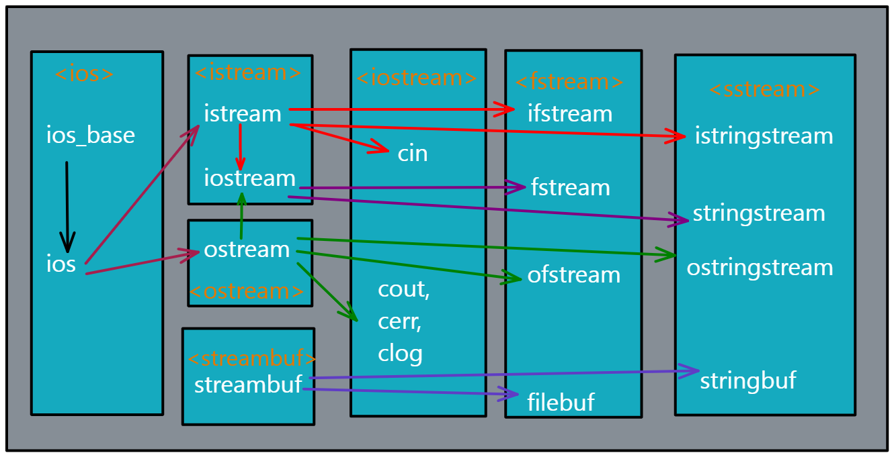

<center> <h1> Entrada y salida </h1></center>

La entrada y salida de datos, para C++ puede ser de distinta forma.

<center></center>

La entrada o salida de datos, básicos con los que se pueden visualizar en la pantalla,
normalmente suele ser una terminal. 
Pero también podemos realizar ingreso y salida de datos, através de un archivos de texto
# Iostream
## COUT

La instancia `cout`, utilizada para la salida estándar que normalmente suele ser
la pantalla de visuzalición. Se utiliza el operador de inserción(<<).

```CPP
#include <iostream>

int main(){
    std::cout << "The standard character output(often by default a screen)";
    return 0;
}
```

## CERR

Utilizado para indicar mensajes de error, y si bien cuentas con l as mismas
característica que el objeto `cout`, este se diferencia que no cuenta con un
buffer para el almacenamiento del mensaje a mostrar.

```CPP
#include <iostream>

int main(){
    std::cerr << "The standard character error output(un buffered)";
    return 0;
}
```

## CLOG

Este también es sirve para mostrar mensaje de error, pero con la diferencia de que
primero inserta el mensaje en un buffer, y hasta que el buffer no se llene por completo
o lo vaciemos con el objet `flush()`. El mensaje de error se mostrará en pantalla.

```CPP
#include <iostream>

int main(){
    std::clog << "The standard character error output(buffered)";
    return 0;
}
```
# Entrada de datos

## CIN

Es común que se solicite algún tipo de datos al usuario, para esto C++ tiene un
standar para el ingreso de datos, desde el teclado del usuario.

CIN: standard input stream. Se utilizan las direcciones `>>`, para indicar a donde se va a dirigir
la información.

```CPP
#include <iostream>

int main(){
    int var;
    std::cout << "Enter the ramdon data ";
    std::cin  >> var; // input data
    std::cout << "The value of var is: "<< var << std::endl;
    std::cout << "The standard character input(often by default a keyboard)";
    return 0;
}
```
