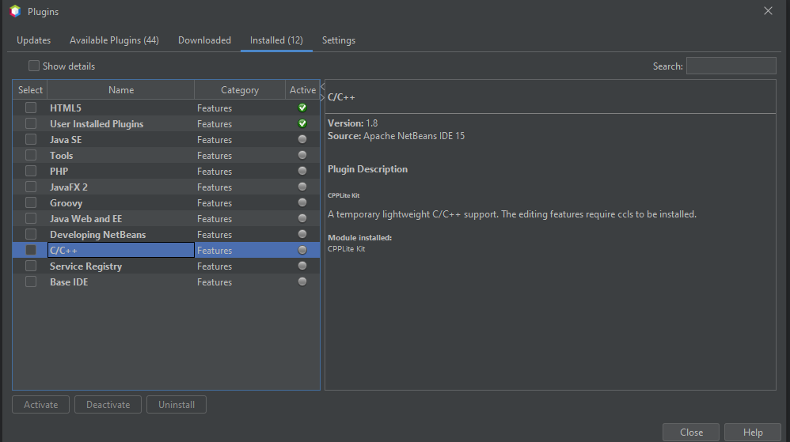

# Instalación en windows

## Instalación del **MinGW** 

1. Primero, descargaremos la siguiente versión [MinGW](https://sourceforge.net/projects/mingw/)
2. Ejecutamos el archivo `.exe` y le damos siguientes hasta que nos aparesca la siguiente imagen

3. Seleccionamos los siguientes paquetes

4. Y aplicamos los cambios; y esperamos a que termine de descargar los paquetes necesarios.

<center></center>

5. Pasamos a editar las variables del entorno del sistema

<center></center>
<center></center>

6. Pasamos a editar las variables del sistema

<center></center>

7. Agregamos las siguientes 2 variables:

```
c:\MinGW\bin
c:\MingGW\MSYS\1.0\bin
```

## Instalación del IDE

En mi caso por temas universitarios, utilizaré el IDE de [*NetBeans*](https://netbeans.apache.org/download/nb16/);
pero se puede utilizar cualquier otro IDE o editor de código de su preferencia.

Si va a utilizar el IDE de *NetBeans*; tendrá que realizar los siguiente pasos; una vez ya lo tenga instalado junto con el *MinGW*
 
1. Nos dirigimos a `Tools>Plugins>Settings` y activamos el siguiente pluggin:

<center></center>

2. Luego nos dirigmos a `Tools>Plugins>Available Plugins` y instalamos el pluggins de C/C++

<center></center>

3. Una vez tengamos instaldo el `MingGW` totalmente instaldo, nos dirigimos a `Tools>Plugins>Options>C/C++`; y debería de ver la ventana; como en la imagen de abajo, caso contrario realiza las modificaciones necesarias.

<center></center>
